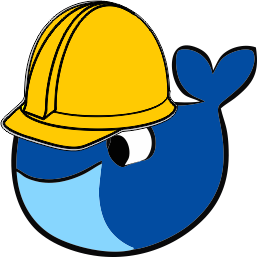
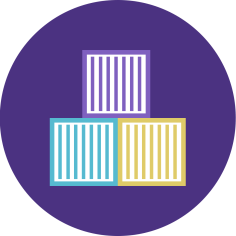
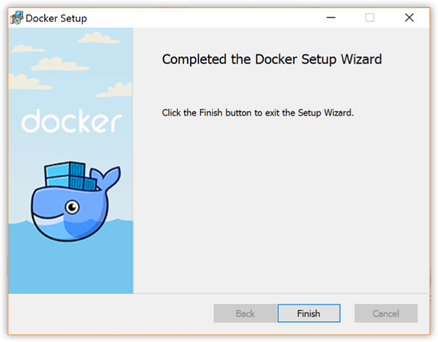
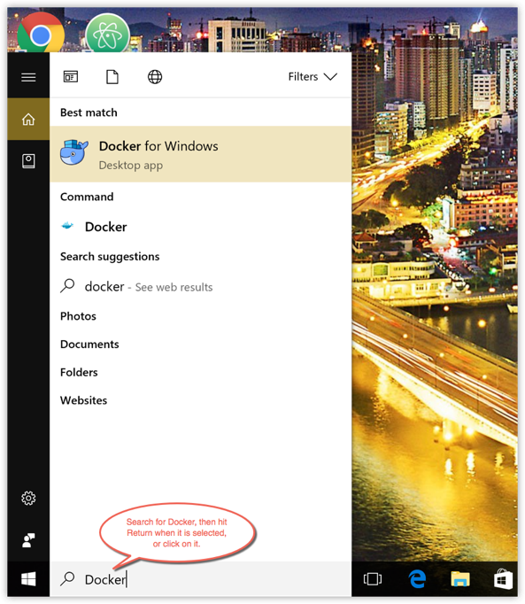
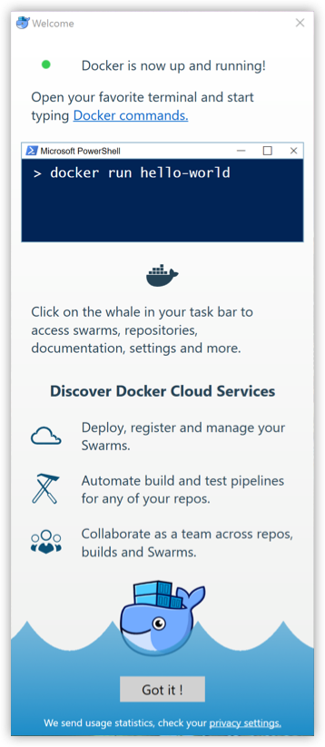
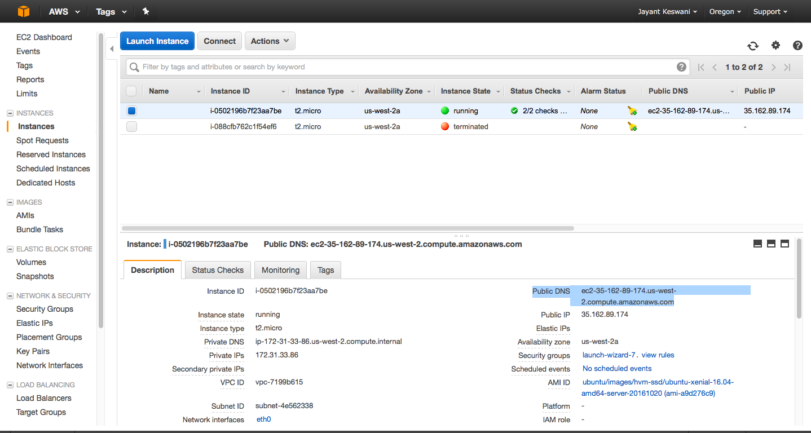

# BioDepot-Workflow-builder (Bwb)
# MANUAL

  
   

Bioinformatics Group
University of Washington Tacoma

## GENERAL INFORMATION

The BioDepot-workflow-builder (Bwb) can be used to build bioinformatics workflows by combining  interchangeable and encapsulated widgets, allowing researchers to easily implement and test new algorithms and observe how the outputs differ. Widgets call  Docker containers to execute software tools that could potentially be written in a different programming language, require different system configurations and/or developed by different research groups.

Docker Image	: [https://hub.docker.com/r/biodepot/bwb/](https://hub.docker.com/r/biodepot/bwb/)

Source code	: [https://github.com/BioDepot/BioDepot-workflow-builder](https://github.com/BioDepot/BioDepot-workflow-builder)


### Overview: Running Bwb
<div class="lower_alpha"></div>1\. Install Docker
2\. Start the container with Bwb by executing the following Docker command by typing into a window (Linux) or on the Docker command line (Windows/macOs)
```bash 
    docker run --rm   -p 6080:6080 \
    -v  ~/Desktop/:/data  \
    -v  /var/run/docker.sock:/var/run/docker.sock \
    biodepot/bwb
```
3\. Open a browser and connect to the Bwb container by typing the following url in the address bar of your browser. In Linux the url is:

   [http://localhost:6080](http://localhost:6080)    

For cloud instances and remote servers use the ip of the instance or remote server instead of localhost.

For Windows and Macs the url is [http://192.168.99.100:6080](http://192.168.99.100:6080) 

For Windows and Macs the IP may vary depending on your setup - instructions are [here](#findip) to find it)

4\. To quit the container, right click inside the browser and choose the QUIT container option. Alternatively, you can also stop it by finding the container id and stopping the container. Quitting the browser just closes the viewport to the container - it does not stop the container.


## Installing and starting Docker

### Linux
<a name="DockerInstall"></a>
1\. Update your package manager index. 

On Debian based distros such as Ubuntu the package manager is apt-get
```bash
sudo apt-get -y update
```
On Redhat based distros such as Fedora/Centos the package manager is dnf or yum  on older systems
```bash
sudo dnf -y update
```
2\. Install Docker.
    Ubuntu;
```bash
sudo apt-get -y install docker-engine
```
Fedora/Centos:
```bash
sudo dnf -y install docker
```
3\.  Start the Docker daemon.
```bash
sudo service docker start
```
4\.  Verify docker is installed correctly.
```bash
sudo docker run hello-world
```

The last command downloads a test image and runs it in a container. When the container runs, it prints an informational message. Then, it exits

For more information please refer to -     

[https://docs.docker.com/engine/installation/linux/ubuntulinux/](https://docs.docker.com/engine/installation/)


### macOS

1\. Download the Docker package -  [Docker for Mac](https://download.docker.com/mac/stable/Docker.dmg)
2\. To install Docker: double-click Docker.dmg to open the installer, then drag Moby the whale to the Applications folder.		

 

3\. To start Docker: double-click Docker.app in the Applications folder. (In the example below, the Applications folder is in "grid" view mode.)

     

You will be asked to authorize Docker.app with your system password after you launch it. Privileged access is needed to install networking components and links to the Docker apps.The whale in the top status bar indicates that Docker is running, and accessible from a terminal.

 


### Windows

1\. To install Docker,

For Windows 10 Pro (with HyperV) download to the package - [Docker for Windows](https://download.docker.com/win/stable/Docker%20for%20Windows%20Installer.exe)

For other versions of Windows, the older toolbox version that uses VirtualBox will need to be installed which is available [here](https://download.docker.com/win/stable/DockerToolbox.exe)

 * go to folder where the installation file (Installer.exe) is saved and run (double-click) the installation file. 
 * click the installer link to download.
 * follow the install wizard to accept the license, authorize the installer, and proceed with the install.
 * when it completes, the installer reports it was successful:
 * click the finish button to complete the installation. 
 

2\.  To start Docker,
* search for Docker, select the app in the search results, and click it (or hit Return).
 
* when the whale in the status bar stays steady, Docker is up-and-running, and accessible from any terminal window.
 


* if the whale is hidden in the Notifications area, click the up arrow on the taskbar to show it. To learn more, see [Docker Settings](https://docs.docker.com/docker-for-windows/#docker-settings).
* If you just installed the app, you also get a popup success message with suggested next steps, and a link to this documentation. 
 


### On The Cloud

On the cloud, BwB can also be run on any cloud instance. Please refer to the Linux and Windows instructions to install Docker on the cloud instance.


#### Amazon AWS

1\.  Login to your console and create a new EC2 instance of ubuntu (Here we are using ubuntu you can choose operating system of your choice)

2\.  Select the configuration and click on "Review and Launch"

3\.  You will be prompted to associate a ssh key pair with the instance, you can use an existing key pair or create a new one. The key will be downloaded onto the computer  which will be later used to ssh into the machine.
 

4\.  Once the instance is running select your instance and scroll right for security groups.

5\.  From "Actions" button select "Edit inbound rules" 

 

6\.  Add a new http rule for port 6080 to access the GUI from the container

 

7\.  Copy the public dns of the instance 

 

8\.  SSH into the instance by typing the following command into the terminal. 
(Type the commands in the directory where the ssh key of AWS instance was downloaded)
```bash
 #(demo.pem is name of the key)
 chmod 400 demo.pem 	`
 ssh -i demo.pem ubuntu@public-dns-of-aws-instance
```
9\.  After you are logged use the instructions [here](#DockerInstall) to install Docker on Linux.

10\. Configure the firewall using the instructions here [http://docs.aws.amazon.com/AWSEC2/latest/UserGuide/authorizing-access-to-an-instance.html](http://docs.aws.amazon.com/AWSEC2/latest/UserGuide/authorizing-access-to-an-instance.html) 


## Starting Bwb

After you have installed Docker on your machine, you are now ready to start your Bwb session to create and execute Docker container workflows. Bwb comes inside its own Docker container so it is first necessary to launch Docker as shown in the previous sections depending on which platform is being used.

Then run the following commands on command prompt / terminal. 
1\.  Download the docker image containing Bwb. 

```bash
docker pull biodepot/bwb:latest
```
 
    
2\.  Start the Bwb container 

```bash
docker run --rm -p 6080:6080 -v ${PWD}:/data -v /var/run/docker.sock:/var/run/docker.sock biodepot/bwb
```

This command will launch a mini-webserver and start a windowing environment inside the container. The Bwb application is automatically launched upon running the container and appears as a maximized window on the Desktop inside the container. In the above command we have set the port to be 6080 and the current directory is mapped to the /data directory inside the container. However, all this is hidden from view until the user connects to the container using a browser. 

To access the container open up a browser window and type in the IP of the container and port that it is listening to into the address bar. For a local installation using Linux, the IP of the container is localhost or 127.0.0.1 so the user would type localhost:6080 into the address bar of the browser. For a remote installation, the ip is the ip of the server.
<a name="findip"></a>
For Macs and Windows machines the local ip is usually [192:168:99:100](http://192:168:99:100:6080) but if that does not work you can find the IP with the following command in a terminal if using Linux/MacOS or in the Docker window if using Windows.

```bash
docker ps
```

More information about finding Docker IP is available here: [https://docs.docker.com/machine/reference/ip](https://docs.docker.com/machine/reference/ip/)

Once connected. A window similar to Figure 1 should appear showing a maximized Bwb window. The interface is a standard windowing one implemented using fluxbox. The icons in the upper right hand corner are used to iconify (hide), minimize/maximize and close the window. Clicking on the area taskbar at the bottom can be used to toggle between windows or hide/show them. In the Bwb window itself is a large drawing canvas. Right-clicking on the canvas brings up the tool menu which has a list of all the available widgets. Widgets can also be dragged onto the canvas from the toolbox on the left. Bwb starts with the Bwb widget toolbox section open. The original Orange ML widgets for machine learning are also available. The different toolbox sections can be opened by clicking on the toolbox banner. 

Note that the Bwb windowing system is inside the browser window. You still have access to whatever windowing system you are using on your host machine. If your browser closes or go to another url, nothing happens to Bwb - the browser merely provides a viewport to the Bwb container. Refreshing or reconnecting the browser to the container IP allows you to interact with Bwb again.


Figure 1: Maximized Bwb window


Figure 2:  Multiple Bwb windows on Desktop

If we hide/iconify the window by clicking on the taskbar or clicking on the iconify button in the upper right hand corner of the window, we see the Desktop itself as shown in figure 2. Right clicking on the Desktop brings up a menu of available applications and the option to QUIT the container. Unlike closing the browser window, this command will actually kill the webserver resulting in the container being stopped. The menu also gives the option of opening another Bwb instance or a terminal. Multiple applications can be launched at same time - and the user has the option of using different workspaces (up to 4) to quickly cycle through different windows. This is especially useful for widget development

## WIDGETS 


### Using widgets


Figure 3:  Different types of widgets

The widget is the main unit of the workflow. Available  widgets are available in the toolbox on the left hand side of the Bwb window. Widgets can specify input, output or software modules. Widgets are dragged from the toolbox onto the canvas and connected to indicate the flow of data. the output of a widget becomes the input of the next connected widget. In this way an analytical pipeline consisting of different modules can transform input data into the final output results.  Many of the software widgets utilize Docker containers that require docker engine. When widgets that are using Docker containers are used, the container will be automatically downloaded from DockerHub if it is not available locally.


### Detailed description of individual widgets


## WIDGET DEVELOPMENT GUIDE


### 1. Development environment

We provide additional tools in a the biodepot/bwb-widget-dev for development of widgets. This includes a full-fledged editor, geany, some graphics tools for making icons and firefox for cutting pasting from stack overflow and other resources and for editing json files inside the container. This can be pulled from Dockerhub

```bash
docker pull biodepot/bwb-widget-dev
``` 
Alternatively the image can be built from source using the Dockerfile

```bash
cd <github repo>
docker build -f ./Dockerfile-widgets -t biodepot/bwb-widget-dev .
```
As the development widget is not yet linked to the github, it is better to build the widget locally

###Overview of widgets and pipelines

Widgets in Bwb represent single tasks, such as an executable, script or a basic operation such as entering the name of a file or directory, or displaying results. Executables and script widgets also define the environment that they are to be run in by specifying a docker container. When a widget A is connected to widget B, one or more outputs of A are connected to the inputs of B. When building the pipeline, the engine manages and keeps track of the connections and sends a signal to each widget when a connection is made or removed. Widgets each have input handlers that update the state of the widget. For example when an input file connection is removed, the widget input handler may wish to change the input file value to None or to a default value. When the pipeline construction is finished, the graph and persistent variables are stored in an .ows file.
 
When the pipeline is to be run, the Bwb/Orange engine follows the graph, executing each widget and then propagating the output to connected widgets which are then executed, until the entire graph is traversed. Widgets can be set to run automatically once all required inputs have been received or to wait for human intervention. Bwb also allows for automatic execution (once all the required elements are present, the widget will execute) and for triggered execution. Once a signal is received by a trigger and all required elements are set or present, the widget will execute. Triggered execution allows for modules to run sequentially in a pipeline.

The orange library uses a python scripts to define each widget. Bwb also uses a json file to store the data needed to form the widget. Bwb has a widget builder allows the user to define a widget by filling a form. The widget builder then produces a python script and json file to define the widget. This makes it possible to quickly convert existing executables and pipelines to Bwb widgets and workflows.


### Bwb widget structure

Bwb widgets consist of three main scrollable windows. The topmost contains entries that are required before the widget can execute (eg. fastq files for alignent). The window below contains optional parameters (eg. number of threads to be used). The bottom window controls execution of the widget and displays a terminal with messages from the widget. When a widget is executed, it starts a command inside a Docker container. Docker will search locally for the container and if it does not find it, will look to download it from the Dockerhub repositories. All the containers provided with Bwb are arvailable through the BioDepot dockerhub [repo](https://hub.docker.com/r/biodepot)

Containers, as a rule, are meant to carry dependencies and smaller supporting files needed by the executable. This is why they are so portable and require no installation to run. Larger input files that may depend on the user (eg data fastq files), are handled by mapping the user volume to a container path that is accessible. The software and scripts inside the container always see the same paths regardless of where the user data actually resides.

#### Generation of widgets using the widget builder

We have greatly simplified and automated the widget development process. The user provides the details of the executable or script, the inputs, outputs, flags and arguments by filling a form provided by the widget builder. This is then converted into a json file which stores the parameters. A barebones python widget file is also created. This instantiates the BwBase base class which provides all the necessary functionality for the 3 basic windows. Default graphical input types are drawn depending on the type of the variable to be entered. For example a variable expecting a file list will cause a texbox with file navigation buttons to be drawn, whereas a string variable will cause a line edit element to be drawn. The user can supersede the default implementation by adding his or her own code.
.
There 4 steps to creating and sharing a widget:

1\. 	Edit json file

2\.	Running createWidget tool to make widget python file

3\.	Save widget files to the correct location in the running Bwb container

4\.	Save the changes made to the Bwb container to a local repository and rebuild the image so that the widgets are saved in Bwb containers launched in th future.


These 4 steps are all handled by the widget builder. 

1\.	Fill out the form to define the data for the json file

2\.	Click on the create widget button to generate the json and python files. These can be edited manually too.

3\.	Click on the register widget button to move the json and python files to the correct locations inside the current Bwb container. The new widgets will appear the next time you launch a Bwb instance.

4\.	Click on the rebuild container button and enter the local Bwb repository you wish to save the changes to. A new image will be built based on the files in the new repository. If you don't do this step, the changes will disappear with the new container.


#### Description of json descriptors (Note that some of this may be outdated) 

The json file describes a dict structure in Python which will be read into the dict *data* in the widget python script.

There are 17 primary fields to the object

**'name' :**  <*str*> -name of widget

**'category' :** <*str*> -may be used in future to group widgets by function

**'icon' :** <*str*> -path of icon file to be used by bwb

**'priority' :**  <*int*>  -priority of widget - used to determine which widget to evaluate first when there are multiple outputs

**'want_main_area' :** <*bool*> -use only if custom code needs second drawing area

**'docker_image_name' :** <*str*> - name of docker image to launch

**'docker_image_tag' :**  <*str*> tag of docker image e.g. latest

**'persistent_settings' :** <*str* or *list*> - 'all', 'none' or list of settings values that will be saved and restored upon launch

**'command' :** <*str*> the command that will be launched 

**'groups' :** <*dict*> - group parameters together - currently not used but will be used to provide support for linked entries such as exclusive checkboxes
```python
	{
	  <str> - name of  group : [ <str>] -list of attribute to be grouped 
	  'type ': <str> - reserved for indicating if group be treated as xor, or linked to a checkbox etc.
	  'callback' : <str> - callback for custom handling of group 
	}
``` 
**'inputs'  :** <*OrderedDict*> -attributes that can obtain values from other widgets
```python
	{<str >- attribute to be input> : <dict>
	   {'type' : <str>, 
	     'callback' : <str>,
	   }
	}
```
**'outputs'  :** <*OrderedDict*> -attributes that store outputs to other widgets
```python
       {<str> - attribute to be output : <dict>
           {'type' : <str>}
       }
``` 
**'volumeMappings'  :** <*list*> -mappings from container to host paths
```
       [ <dict>
         {'conVolume' : <str> - path of container volume to be mapped :
           'attr' : <str> - attr which stores the path of the host container
           'default' : <str> default value of the host path
         }
       ]
```
**'requiredParameters' :** <*list*> -list of attributes or groups that are required to be entered or obtained from inputs
**'parameters'** : <*Ordered dict*> - parameters and arguments to be entered
```Python
      {<str> - attr where parameter value is stored : <dict>
         {'flags' :  [<list of str>] -one or morecommand line flags used to specify the parameter - if empty then it is an argument - if None then it is not on command line
           'label' : <str> -used by GUI as short label to indicate what is to be entered
           'type;' : <str> -type of the value to be entered
           'default' : <depends on 'type' field> default value used to initialize - otherwise None
           'env' :<str> -environment variable in the container that is to be assigned this value
           'gui' : <one of 'FileDir', 'Ledit', 'Spin', 'bool'> - tells Bwb to use a specific gui element instead of the default one based on 'type' 
          }  
       } 
```

### Creating widget

Open a terminal in Bwb by minimizing the Bwb window and right clicking.
Type in the following
```bash
	createWidget -i <jsonfile> -o <widgetFile.py> --register
```
Open a new instance of Bwb and you should see the new widget in the toolbox.
A sample json file is in the /biodepot/orangebiodepot/json directory

### BwBase class

The abstraction of the widget details is handled by the Bwb class which is responsible for the following tasks:

1\. Keeping track of connections

2\. Handling input signals

3\. Drawing the GUI form 

4\. Calling the Docker API to launch the executable

#### Keeping track of connections
The current engine does not send a signal to a widget if the output connections are modified so durrently, only connections to inputs are kept. This is done using the inputConnections object which is an instance of the custom ConnectionDict class. This class is a simple extension of the basic dict class in Python, with add, remove and isConnected methods. 

#### Handling input signals
A signal is sent to an input when it is connected to an output, disconnected from an output or when a signal is sent from a connected output. The current engine requires that each input have a separate callback - there is no way around this using lambdas or partial functions due to how Orange handles signals. Bwb handles this by having a wrapper function pass the identity of the input along with the signal to the **handleInputs** method of Bwb.

#### Drawing an managing the GUI form
There are 4 main elements that are drawn:

1\. Status box - error messages and progress and other informational messages are displayed here

2\. Required parameters - the form for the parameters required to run the widget are here

3\. Optional parmeters - a list of optional parameters is placed here

4\. Execution box - whether the widget is run automatically, manually, or semi-automatically depending on runTriggers is set here

The master methid is the **drawGUI ** method which draws the Status box and calls **drawRequiredElements**, **drawOptionalElements**, and **drawExec** to draw the other elements. It then calls **checkTrigger **to see if it should start running the Docker process.

**drawRequiredElements** and **drawOptionalElements**, loop through the parameters, initializes the value of the attributes and sends them to one of **drawCheckbox,** **drawSpin,** **drawLedit,** **drawFileDirElements** depending on the type of the parameter or whether a specific element was specified by the 'gui' field. There is also a **drawFilesBox** method element for entering and rearranging multiple elements. All optional elements are drawn with a checkbox, and inactive unless the checkbox is checked. All elements that are inputs are only active when there is no input from another widget that is responsible for defining a value. Elements of the same type are grouped together. This is done by mostly by the **bgui** object which is an instance of the **BwbGuiElement** class. bgui keeps track of all the gui elements associated with the a particular attribute and activates or inactivates them.

The different draw routines are described next:

**drawCheckbox:** Used for booleans. Checked means value is True - otherwise False. The checkbox provided by the Orange **gui** class is used

**drawLedit :** A single line ised for text entry and for non-integers. The **bwbLedit ** method is used instead of the Orange **gui** method to specify the layout of the button, label and line elements so that they line up correctly.

**drawSpin :** Used for entering integers - default range is 1 to 128 - for higher ranges the user should specify use of a drawLedit with the 'gui' keyword in the 'parameters' dict . The Orange **gui** code is used for this element.

**drawFileDirElements** : a single line with a label and browse button used for entering directories, file, or a list of files. The browse button is used to choose a directory of a file. When in files mode, the button appends to a list of files. A clear button is provided that clears the line. The browse functions are managed by the **browseFileDir** method, All paths returned by the browser are relative to the Bwb container filesystem (where /data is the usual portal to the user filesystem). These paths are later converted to hostpaths before execution.

**drawFilesBox** : This provides a box for entry of multiple items, not just files and directories. The items are entered using a line edit field at the bottom of the box. Entries are added or subtracted using the buttons next to the field. For files and directories an additional browse button is provided to traverse the files. Entries in the box can be re-ordered by dragging and dropping. This is necessary, for example, for pair-end reads where the order of the file arguments can matter depending on the application. 

**drawExec** : Elements in this box control the execution of the software encapsulated by the widget. There is always a start button which will start the run. A comboBox allows the user to choose between manual, automatic and triggered execution modes. In manual mode, execution only starts after the user pushes the start button. In automatic mode execution will start when all the required parameters have been entered. If there are inputs that are not required, then the user may choose to have additional triggers. In other words, the user may choose to wait for one or more signals to be recevied on these inputs before starting the execution. When trigger mode is chosen, a menu is enabled to allow the user to choose the inputs that are to be used as triggers. When in trigger mode, all the required parameters must be set and signals must be set (has received a signal that is not 0). 

The idea of triggers is to allow for previous requisite steps to signal that they are finished and that the widget should start. This can happen even if the output on the output stream is not used by the widget. For example, an alignment widget may produce a set of SAM files in a directory and output the directory. Rather than forcing the analysis widget to have a separate input to receive the input, the directory output may be connected to the generic trigger input instead. 

Currently only one output can be connected to a trigger. However, support is being added so that multiple signals can be connected to the trigger and the user can choose whether to begin when any of the signals are received or when all the signals are received.

Currently, when the job is launched, all the gui elements are disabled and get re-enabled after the job terminates. Support will be added to allow the user to interrupt the widget and also for messages to be sent to the console window and automatically logged.

**N.B.** For the most part, once the elements are drawn, they stay drawn - only the states change depending on what signals are received either from the user or from another widget.

#### Launching the executable with Docker
Once the widget has decided to launch the executable, it calls the startJob method. The **startJob** method will check that are the required parameters have been set. It will then check that all the container volumes that are specified in the **volumeMappings** field of the json file are mapped to host directories. If these criteria are met, then the command is generated from the parameters with the **generateCmdFromData** and **generateCmdFromBash** methods. Some of the parameters may be passed as environment variables as well if specified in the json file. This is handled by the **getEnvironmentVariables** method. The commands, environment variables and volumemappings are passed to docker run routines which call dockerpy to pull the container if it is not present and then run it.

Directory paths are a bit complicated as there are 3 different file systems. There is the container filesytem that is being launched, the host system (i.e the laptop or cloud instance) and also the filesytem used by the Bwb container. The file browsers used by the bwb GUI use the bwb directory paths. These are converted to host paths for the volume mappings. There can be multiple possible mappings - the shortest mapping is used.

Support will be added for an additional automap mode that will automatically map the file system the user has provided to bwb to the same paths in the container launched by the widget.


